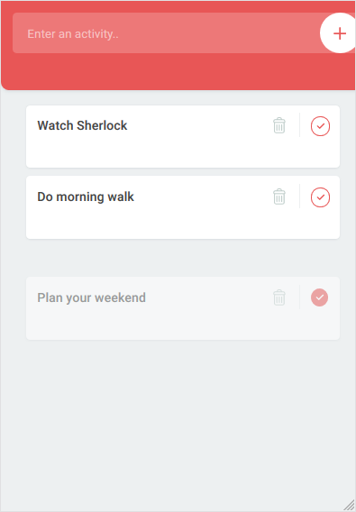

# To-Do App with JavaScript
Keep your fancy list of actions to do.

# How to Use
You can add➕ remove🗑️ and complete✔️ items on your list. New added items will go to the top. The completed items will go to the bottom and will fade. If you click complete✔️ on faded(completed) items they will go back to the original list so you can complete them again. 

# Further Development
The first version of To-do App is a front-end application. Currently working to integrate it with back-end.

# Tools & Techs Used
**Tech stack:** JavaScript, NodeJS, ExpressJS, Postman, HTML, CSS and WebStorm

## Developer
[@hakaneroztekin](www.github.com/hakaneroztekin)

## Credits
Special thanks to Max for his [tutorial](https://www.youtube.com/watch?v=2wCpkOk2uCg).

